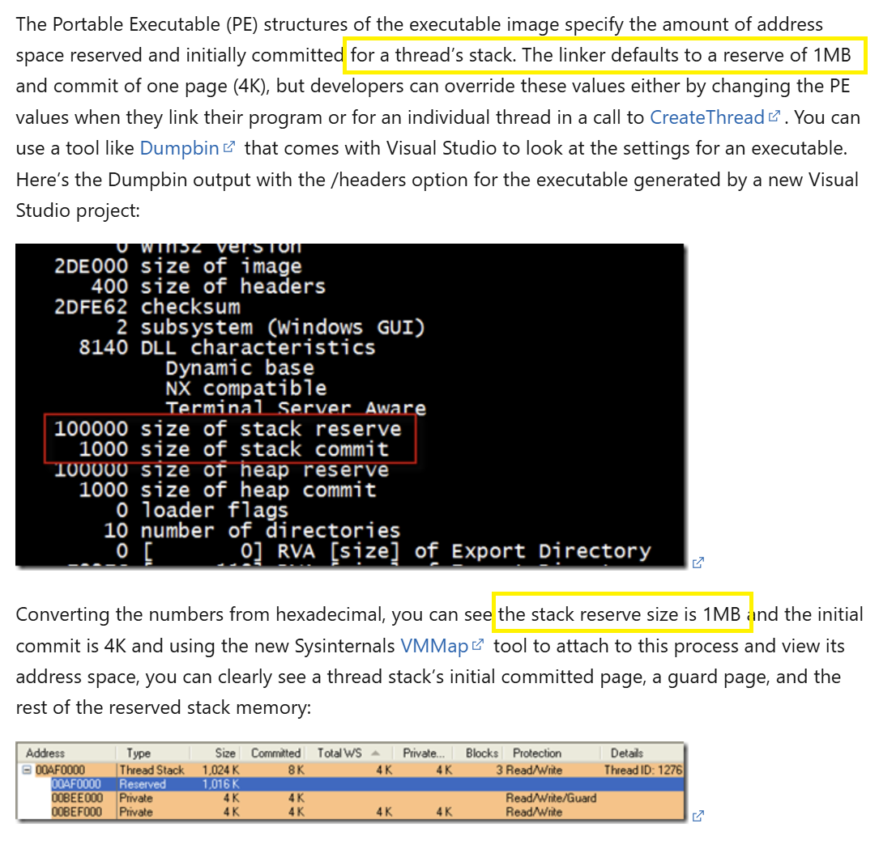

**Improvements** (3 items)

If you have suggestions for improvements, then please [raise an issue in this repository](https://github.com/markjprice/tools-skills-net8/issues) or email me at markjprice (at) gmail.com.

- [Page 6 - Setting up your development environment](#page-6---setting-up-your-development-environment)
- [Page 24 - Setting up SQL Server and the Northwind database](#page-24---setting-up-sql-server-and-the-northwind-database)
- [Page 156 - Understanding stack and heap memory](#page-156---understanding-stack-and-heap-memory)

# Page 6 - Setting up your development environment

The bullet for Visual Studio currently says:
- Visual Studio: Visual Studio 2022 for Windows. (Visual Studio 2022 for Mac reaches end-of-life on August 31, 2024, and is not recommended.)

In the next edition, I will add a note that you could also use Visual Studio in a virtual machine, or use Microsoft Dev Box: https://azure.microsoft.com/en-us/products/dev-box.

A reader, `@automaton` posed a thought in the Discord channel for this book: "I wonder if the idea long term is to merge Code and VS."

`@markjprice`: "My best guess is that .NET developers on Windows will continue to prefer Visual Studio, and everyone else will prefer VS Code. Microsoft has been clear about their commitment to improving both Visual Studio and VS Code but keeping them distinct in their roles. While VS Code continues to be enhanced with new features and cross-platform capabilities, Visual Studio remains focused on being a best-in-class IDE for development on Windows. Visual Studio is deeply integrated with Windows-specific technologies and APIs. It leverages components such as the Windows Presentation Foundation (WPF), which is not natively supported on other operating systems. Rewriting or adapting these dependencies for other platforms would require significant effort and resources. Microsoft will never port Visual Studio to other platforms or merge the two products. Instead, they will continue to add features from each to the other e.g. Solution Explorer added to VS Code, and HTTP Editor added to Visual Studio."

In the next edition, I will add a note similar to the above explaining why Microsoft won't merge or replace either product any time soon.

# Page 24 - Setting up SQL Server and the Northwind database

> Thanks to `CoericK` for asking a question in the book's Discord channel that prompted this improvement item.

`@CoericK`: "Hello @markjprice , I have a question, I'm running MacOS Catalina, according to your suggestions on page 24, your recommend to install Azure SQL Edge container for linux (i assume macos as well), https://github.com/markjprice/tools-skills-net8/blob/main/docs/sql-server/edge.md, however I already have an existing docker container running this image as base mcr.microsoft.com/mssql/server:2022-latest and installing mssqlserver via apt-get  apt-get install -y mssql-server-fts, can I just use my existing container? or would it be better to follow along your instructions for this book using Azure SQL Edge?"

`@markjprice`: "You can use your existing container. Just be aware that the SQL script will create a database named `Northwind` in a schema named `dbo`. That shouldn't be an issue or conflict with any existing SQL objects that you have. I say to use SQL Edge partly to provide extra separation between what you'll do in the book, and what you might already have. "Use at your own risk." as they say. 🙂 You sound like you know what you're doing."

`@CoericK`: "Thanks Mark, I think that I will create an azure sql edge container, and run it at a different port, I assume I will have to customize the conection port where required"

`@CoericK`: "created it on port 1434, worked like a charm. I'm using Azure Data Studio on MacOS btw"

`@CoericK`: "i used this tool to generate the connection string https://www.aireforge.com/tools/sql-server-connection-string-generator"

`@automaton`: "My issue was with the Trust certificate in the connection string, something that isn't prompted necessarily though the VSCode extension."

`@CoericK`: "I'm on mac, So in order to follow along the guide I had to create a virtual machine with windows install visual studio a connect to thee db in the host machine, since I'm using SQL Server Edge I had to run this command to get the classes created on page 28
 `dotnet ef dbcontext scaffold "Data Source=HOSTNAME,PORT;Integrated Security=false;User ID=sa;Password=YOUR_PASSWORD;TrustServerCertificate=True;Initial Catalog=Northwind;" Microsoft.EntityFrameworkCore.SqlServer --namespace Northwind.EntityModels --data-annotations`"

In the next edition, *Tools and Skills for .NET 10*, I will add notes about how to use existing SQL Server instances, how to customize the port number to avoid conflicts with existing container images, and tools like Azure Data Studio and websites for generating database connection strings. I will also add a note about trusting the certificate in the connection string too.

# Page 156 - Understanding stack and heap memory

> Thanks to [P9avel](https://github.com/P9avel) for raising an [issue on September 18, 2024](https://github.com/markjprice/tools-skills-net8/issues/5) that led to this improvement.

At the start of the third paragraph, I wrote, "On Windows, for ARM64, x86, and x64 machines, the default stack size is 1 MB." 

This sentence is correct. 

Mark Russinovich is a Microsoft expert and he wrote a deep dive article about memory and threads that is worth reading. You can find it at the following link:
https://learn.microsoft.com/en-us/archive/blogs/markrussinovich/pushing-the-limits-of-windows-processes-and-threads

Here are some relevant highlights:

Note that the 1MB limit is a default and that "developers can override these values". The .NET team decided to override the default so that .NET apps have 1.5 MB of stack memory, but this was a "completely accidental change", as you can read about in the following comment to a GitHub issue in the .NET repository: https://github.com/dotnet/runtime/issues/96347#issuecomment-1871528297

"Prior to this change, we have been using the Windows native toolset default before that is 1MB."

If this issue might affect your projects, I recommend reading the following issue: [Migration from .NET Framework 4.7.2 to .NET 8 results in StackOverflowException due to reduced stack size](https://github.com/dotnet/runtime/issues/96347).

